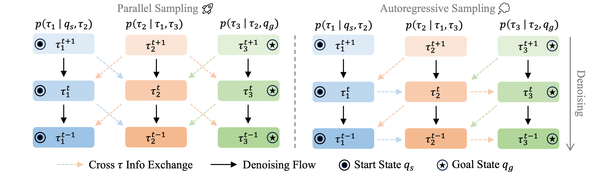
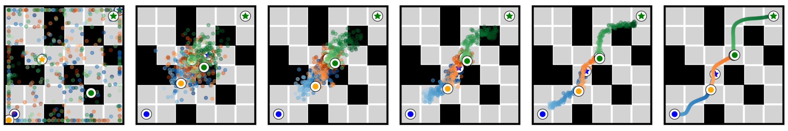

# Generative Trajectory Stitching through Diffusion Composition

[[Project page]](https://comp-diffuser.github.io/)
[[Paper]](https://arxiv.org/pdf/2503.05153)
[[ArXiv]](https://arxiv.org/abs/2503.05153)
<!-- [![][colab]][maze2d-eval-demo] -->
<!-- [[Data]]() -->
<!-- [Colab]() -->
<!-- declare varibles -->
<!-- [colab]: <https://colab.research.google.com/assets/colab-badge.svg> -->
<!-- [maze2d-eval-demo]: <https://colab.research.google.com/drive/1pARD89PfSzF3Ml6virZjztEJKWhXVkBY?usp=sharing> -->


[Yunhao Luo](https://devinluo27.github.io/)<sup>1</sup>,
[Utkarsh A. Mishra](https://umishra.me/)<sup>1</sup>,
[Yilun Du](https://yilundu.github.io/)<sup>2,†</sup>,
[Danfei Xu](https://faculty.cc.gatech.edu/~danfei/)<sup>1,†</sup>

<sup>1</sup>Georgia Tech,
<sup>2</sup>Harvard,
<sup>†</sup>Equal Advising


This is the official implementation for "*Generative Trajectory Stitching through Diffusion Composition*".

<!-- See this codebase for potential-based diffusion motion planning [potenial-motion-plan-release](https://github.com/devinluo27/potential-motion-plan-release). -->

<!-- <br> -->
<p align="center" style="margin-bottom: 0.2em;">
  
</p>

**Compositional Trajectory Planning: Parallel Sampling and Autoregressive Sampling.**
We present an illustrative example of sampling three trajectories $\tau_{1:3}$ with the proposed compositional sampling methods.
Dashed lines represent cross trajectory information exchange between adjacent trajectories and black lines represent the denoising flow of each trajectory.
In parallel sampling, $\tau_{1:3}$ can be denoised concurrently; while in autoregressive sampling, denoising $\tau_k$ depends on the previous trajectory $\tau_{k-1}$, e.g., the denoising of $\tau_2$ depends on $\tau_1$ (as shown in the blue horizontal dashed arrows). Additionally, start state $q_s$ and goal state $q_g$ conditioning are applied to the trajectories in the two ends, $\tau_1$ and $\tau_3$, which enables goal-conditioned planning.
Trajectories $\tau_{1:3}$ will be merged to form a longer plan $\tau_{\text{comp}}$ after the full diffusion denoising process.

<br>
<!-- margin-top: 0.4em;  -->
<p align="center" style="margin-bottom: 0.2em;">
  
</p>
<p align="center"><strong>Denoising Process of CompDiffuser.</strong></p>


<!-- ## 🛝 Try it out!
We provide a Google Colab notebook [![][colab]][maze2d-eval-demo] for the Maze2D enviornments.  In this notebook, you can enter your own obstacle locations and set the agent's start/goal positions, and use the pre-trained model to generate motion plans. Additional jupyter notebook demos can be found in the `examples` directory. -->
<!-- Check out our Google Colab notebooks for motion plan generation here. -->


## 🛠️ Installation
The following procedure should work well for a GPU machine with cuda 12.1. Our machine is installed with Ubuntu 20.04.6 LTS.

<!-- and loads the following modules:
```
1) zlib; 2) cuda/11.8.0; 3) git-lfs; 4) expat; 5) mesa/22.1.6; 6) libiconv; 7) ffmpeg; 8) glew;
```
For some other Linux versions, the equivalent modules might be required.  -->

Please follow the steps below to create a conda environment to reproduce our simulation benchmark results on OGBench environments.

1. Create a python env.
```console
conda create -n compdfu_ogb_release python=3.9.20
```
Please keep the conda env name as above, since it is used as an identifier in the python code.

2. Install packages in `requirements.txt` (this might take several minutes).
```console
pip install -r conda_env/requirements.txt
```

3. Install gymnasium, gymnasium-robotics, and torch 2.5.0.
```console
./conda_env/install_pre.sh 
```

<!-- https://seohong.me/projects/ogbench/ -->
<!-- [official OGBench](https://seohong.me/projects/ogbench/) -->
4. Clone the CompDiffuser customized OGBench codebase [ogbench_cpdfu_release](https://github.com/devinluo27/ogbench_cpdfu_release)  and install it to conda env `compdfu_ogb_release`. (Our major revision is adding some rendering code to the official OGBench.)
```console
## Please set the OGBench path in the script before running this line
./conda_env/install_ogb.sh
```

After these steps, you can use conda env `compdfu_ogb_release` to launch experiments.

<!-- pip install -r requirements.txt -->

<!-- <p align="center">
  
</p> -->

<!-- 📦 🗃️ 📥 🗂️ 🧩 🎨 🔮 -->

## 🗃️ Prepare Data

1. Download the official OGBench datasets for model training.  
We provide a jupyter notebook file at `conda_env/ogb_dset_download.ipynb` to download the official OGBench datasets. 
The datasets will be downloaded to `~/.ogbench/data/` by default and you only need to download the corresponding datasets that you want to use, such as `antmaze-giant-stitch-v0` and `pointmaze-large-stitch-v0`. Please see the OGBench paper for a full list of available environments.

2. Evaluation problem sets.  
We provide an evaluation problem set for each OGBench environment we use at `data/ogb_maze/ev_probs`, which are already stored in this repo. Each of those `.hdf5` files stores 100 pairs of start state and goal state (5 evaluation tasks with 20 evaluation problems per task). 

<!-- Specifically, for each environment, there are  -->
<!-- Please see this file for additional details.  -->


## 🕹️ Train CompDiffuser Planner
Please download the official OGBench datasets first before starting to train models. To launch the training for CompDiffuser, run
```console
sh ./diffuser/ogb_task/ogb_maze_v1/train_ogb_stgl_sml.sh
```
You can change the `$config` variable inside the script above to launch different experiments. 

<!-- You can refer to the default config in the script as template. -->
<!-- See the `dset_h5path` in this config file for details. -->
We provide a config `config/og_antM_Gi_o2d_luotest.py` for debugging purposes. Note that for this file, we set the train dataset to a very small subset of the official dataset for faster data loading. The dataset switching is done by `dset_h5path` in this config file; otherwise, it will load the full official datasets if this varibale is not set.
Hence, please comment out or remove this variable after debugging (e.g., if you want to reproduce our results).
<!-- (so byyou will use the) -->

We also provide configs to train CompDiffuser in each OGBench environment. For example, for `antmaze-large-stitch-v0`, we can set the config file to
```console
## planning in 2D (x-y) state space
config=config/ogb_ant_maze/og_antM_Gi_o2d_Cd_Stgl_PadBuf_Ft64_ts512.py
## planning in full 29D state space
config=config/ogb_ant_maze/og_antM_Lg_o29d_DiTd1024dp12_PadBuf_Ft64_fs4_h160_ovlp56MditD512.py
```
<!-- Please see the `config/` folder for more provided config files. -->
More provided config files are inside the `config/` folder.


## 🕹️ Train Inverse Dynamics Model
The diffusion planner generates a trajectory of agent states (e.g., x-y position, joint states). We then use an inverse dynamic model to predict actions for the agent to execute in the environment (except for pointmaze where we use a PD controller).  
Specifically, the inverse dynamic model is an MLP that takes the current agent state and a synthesized goal state as input and will output an action.  

We provide code to train such models, run (similarly, check the `$config` in the script first)
```console
sh ./diffuser/ogb_task/og_inv_dyn/train_og_invdyn.sh
```

Note that we provide config file to train the inverse dynamics models for multiple environments. Please set the `$config` inside the script to the path you need before starting the training. For example, if you want to train a model for `antmaze-large-stitch-v0` and the diffusion planner generates the full 29D trajectory (hence the synthesied goal is 29D), `$config` should be set to
```
config=config/ogb_invdyn/og_inv_ant/og_antM_Lg_o29d_g29d_invdyn_h12.py
```

## 📊 Using Pretrained Models


### Downloading weights
We provide links to pre-trained CompDiffuser planner and inverse dynamics models below, along with their corresponding config files. All models are hosted under this OneDrive [folder](https://1drv.ms/f/c/b25b9b5879968c8a/EskQ59ChhAxBlKYvBDobAcEBVhfMTx5f3GyYHlo6bi7qFw).

For pointmaze env (config files are in folder `config/ogb_pnt_maze`):
| Env | Link | Config
| :---: | :---: | :---: |
| `pointmaze-giant-stitch-v0` | [Link](https://1drv.ms/u/c/b25b9b5879968c8a/EXgkPEtnqOBOq-Ir8e4hFZsBmFf4hXr3FlTagqpCq0oqLQ) | `og_pntM_Gi_o2d_Cd_Stgl_PadBuf_Ft64_ts512.py` |
| `pointmaze-large-stitch-v0` | [Link](https://1drv.ms/u/c/b25b9b5879968c8a/Efrwd3cuWidPv2nq2W_EfDQBLzbYFZjfuA3LGA8NqBYqTg?e=58XtKd) | `og_pntM_Lg_o2d_Cd_Stgl_PadBuf_Ft64_ts512.py` |
| `pointmaze-medium-stitch-v0` | [Link](https://1drv.ms/u/c/b25b9b5879968c8a/EUI2-KrjDYZElhKDViVSjBkBDG2avxZ03IjoqQeegSWo3Q?e=7H9XyF) | `og_pntM_Me_o2d_Cd_Stgl_PadBuf_Ft64_ts512.py` |


For antmaze env (config files are in folder `config/ogb_ant_maze`, please also download the weights of the pre-trained inverse dynamics models):
| Env | Link | Config
| :---: | :---: | :---: |
| `antmaze-giant-stitch-v0` | [Link](https://1drv.ms/u/c/b25b9b5879968c8a/EQVxZKJ__NlMrbtrQ9W9_PUBe6yOs6PWeSvT6gJs3C7Osw?e=231cfQ) / [Link(inv dyn)](https://1drv.ms/u/c/b25b9b5879968c8a/EZJrzYzOXSVLsTxgHADluNIBUXSEvCm37in5IW5fL0foqQ?e=CwVOLD) | `og_antM_Gi_o2d_Cd_Stgl_PadBuf_Ft64_ts512` |
| `antmaze-large-stitch-v0` | [Link](https://1drv.ms/u/c/b25b9b5879968c8a/EXZ4pU2cV01Fq5e-W7tAjcMBlH0BvIbneLCA5L17Rpp7dQ?e=MHGwod) / [Link(inv dyn)](https://1drv.ms/u/c/b25b9b5879968c8a/ESKNSFuqUTtAmlkjLyxCr2YBxMfd0J17PHMNwqdp5C_jKQ?e=QLNaBO) | `og_antM_Lg_o2d_Cd_Stgl_PadBuf_Ft64_ts512` |
| `antmaze-medium-stitch-v0` | [Link](https://1drv.ms/u/c/b25b9b5879968c8a/ERInZeieeOdKvWRuhQZUQa4Btb2Dbdj6ZULHK8VWz-TwWw?e=jInClo) / [Link(inv dyn)](https://1drv.ms/u/c/b25b9b5879968c8a/Ed3ElIVz3pJJq5-HqGZK6-gBniMFox109vYCieHI7UU_fg?e=8Uu6Hh) | `og_antM_Me_o2d_Cd_Stgl_PadBuf_Ft64_ts512` |


Additionally, we also provide checkpoints for high-dimenstional planner in OGBench `antmaze-large-stitch-v0` environment inside this oneDrive [folder](https://1drv.ms/f/c/b25b9b5879968c8a/EjozjTb6qOFHi2oCsxdiJNEBZGJJEBcpuBbd6p3LT-NGvg?e=gPCZ8p) (also see Table 4 of our paper).

| Env | Dim | Config
| :---: | :---: | :---: |
| `antmaze-large-stitch-v0` | 15D | `og_antM_Lg_o15d_PadBuf_Ft64_ts512_DiTd768dp16_fs4_h160_ovlp56Mdit` |
| `antmaze-large-stitch-v0` | 29D | `og_antM_Lg_o29d_DiTd1024dp12_PadBuf_Ft64_fs4_h160_ovlp56MditD512` |

<!-- | Env | Dim | Link | Config
| :---: | :---: | :---: | :---: |
| `antmaze-large-stitch-v0` | 15D | [Link](https://1drv.ms/u/c/b25b9b5879968c8a/EXZ4pU2cV01Fq5e-W7tAjcMBlH0BvIbneLCA5L17Rpp7dQ?e=MHGwod) / [Link(inv dyn)](https://1drv.ms/u/c/b25b9b5879968c8a/ESKNSFuqUTtAmlkjLyxCr2YBxMfd0J17PHMNwqdp5C_jKQ?e=QLNaBO) | `og_antM_Lg_o15d_PadBuf_Ft64_ts512_DiTd768dp16_fs4_h160_ovlp56Mdit` |
| `antmaze-large-stitch-v0` | 29D |  [Link]() / [Link(inv dyn)]() | `og_antM_Lg_o29d_DiTd1024dp12_PadBuf_Ft64_fs4_h160_ovlp56MditD512` | -->

<!-- 
| Dim | Link | Config
| :---: | :---: | :---: |
| 15D | [Link]() / [Link(inv dyn)]() | `og_antM_Lg_o15d_PadBuf_Ft64_ts512_DiTd768dp16_fs4_h160_ovlp56Mdit` |
| 29D |  [Link]() / [Link(inv dyn)]() | `og_antM_Lg_o29d_DiTd1024dp12_PadBuf_Ft64_fs4_h160_ovlp56MditD512` |
 -->


### Unzip Downloaded Files

You need to put the downloaded zip files in the root directory of this repo and unzip them, so that the created files can be in proper relative locations.
The files will be automatically put under the `logs` folder, which is organized roughly according to the following structure (some additional prefix and postfix might be added):
```
└── logs
    ├── ${environment_1}
    │   ├── diffusion
    │   │   └── ${experiment_name}
    │   │       ├── model-${iter}.pt
    │   │       └── {dataset, trainer}_config.pkl
    │   └── plans
    │       └── ${experiment_name}
    │           ├── 0
    │               ├── {experiment_time:%y%m%d-%H%M%S}
    │               ├── ...
    │
    ├── ${environment_2}
    │   └── ...
```

The `state_${iter}.pt` files contain the network weights and the `{}_config.pkl` files contain the instantation arguments for the relevant classes. 

<!-- A dummy random action dataset will also be created as a placeholder for loading. -->

<!-- 
For example,
```console
[potential-motion-plan-release]$ unzip .zip -d .
``` -->

 <!-- and placed them in appropriate directory,  -->
### Policy Rollout
After downloading and unzipping the model weights, you can launch planner rollout using the script provided below. The results will be saved in `.mp4` and `.json` files.
To evaluate different models, you can change the `$config` varibale inside the script, which should be the relative path to a config file.

For OGBench environments, run:
```console
sh ./diffuser/ogb_task/ogb_maze_v1/plan_ogb_stgl_sml.sh $1 $2 $3
```

Please replace `$1` by a GPU index (e.g., 0), `$2` by how many episodes to evaluate on (e.g., some number between 1 and 100), and `$3` by a seed (i.e., an integer 0).


<!-- ### Jupyter Notebook Examples
To help you better understand and use the codebase, we provide multiple jupyter notebooks under `examples` folder, where you can generate motion plans and visualize them interactively. Feel free to try them out. If missing files are reported, please download the corresponding files from the OneDrive link above.  -->


<!-- ======================= -->

<!-- ## 🔩 Key Components -->

## ➕ Add an Experiment
We create a new config file under the `config` folder for a new experiment. Each experiment will create a new folder under `logs`. You can refer to existing config files as examples.


## 📔 Baselines
<!-- Currently,  -->
#### Decision Diffuser
We provide implementation of Decision Diffuser (DD) in `diffuser/baselines`.  

To train a DD planner, run
```console
./diffuser/baselines/dd_ogb/train_dd_ogb.sh
```
To evaluate a DD planner, run
```console
./diffuser/baselines/dd_ogb/plan_dd_ogb.sh
```

#### Generative Skill Chaining (GSC)
<!-- due to difference in the task setup, -->
<!-- this GSC implementation is slightly different described in the GSC paper. -->
We also provide implementation of GSC. Note that since our task setup is different with the tasks in the GSC paper, our implementation also slightly differs (See Appendix F of our CompDiffuser paper for details).  

You can directly perform GSC style inference, by setting
```python
args.ev_cp_infer_t_type = 'gsc'
```
in `diffuser/ogb_task/ogb_maze_v1/plan_ogb_stgl_sml.py`, then run
```console
sh ./diffuser/ogb_task/ogb_maze_v1/plan_ogb_stgl_sml.sh $1 $2 $3
```
replace `$1` by a GPU index (e.g., 0), `$2` by how many episodes to evaluate on (e.g., some number between 1 and 100), and `$3` by a seed (i.e., an integer 0).

#### CompDiffuser Variants
Two variants of CompDiffuser are available `Parallel Denosing` (as shown in the figure above) and `backward autoregessive` (See Appendix B.4 of the paper). Similarly, set
```python
args.ev_cp_infer_t_type = 'same_t_p' # for parallel
## or
args.ev_cp_infer_t_type = 'ar_back' # for backward autoregressive
```


## 🎨 Visualization
See `diffuser/utils/ogb_paper_vis_utils/` for the modified mujoco env to create multi-agent (e.g., multi-ants) env, which is used to render the figures in our paper. We might add more instructions later.


## 🏷️ License
This repository is released under the MIT license. See [LICENSE](LICENSE) for additional details.


## 🙏 Acknowledgement
* The implementation of CompDiffuser is based on 
[diffuser](https://github.com/jannerm/diffuser),
[decision-diffuser](https://github.com/anuragajay/decision-diffuser/),
and
[potential-motion-plan](https://github.com/devinluo27/potential-motion-plan-release).

* We thank [OGBench]() for creating the useful evaluation benchmark.

Contact [Yunhao Luo](https://devinluo27.github.io/) if you have any questions or suggestions. We may update and add more code implementation upon request.

## 📝 Citations
If you find our work useful, please consider citing:
```
@article{luo2025generative,
  title={Generative Trajectory Stitching through Diffusion Composition},
  author={Luo, Yunhao and Mishra, Utkarsh A and Du, Yilun and Xu, Danfei},
  journal={arXiv preprint arXiv:2503.05153},
  year={2025}
}
```
